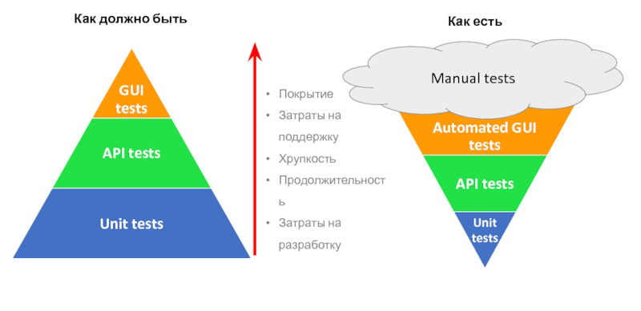

<!-- _paginate: false -->
# DDD на практическом примере:
## Расчет диаграммы Ганта

Автор: `Шапошников Евгений`
ЯП: `JavaScript`

---


# График Ганта

## Введение в предметную область

Картинка

---

#  Что такое DDD

**DDD** - domain driven design

Состоит из частей:
- Стратегическое проектирование
- Тактическое проектирование

---
# Стратегическое проектирование

- Единый язык
- Ограниченные контексты
- Event Storming

---

# Тактическое проектирование

Основные сущности:
- Агрегат
- Репозиторий
- Сервис

---

# Список агрегатов

- Элемент графика (работа)
- Связи
- ППР
---

# Диаграмма

<div class="mermaid">
sequenceDiagram
    participant John
    participant Alice
    Alice->>John: Hello John, how are you?
    John-->>Alice: Great!
</div>

---

# Описание сценария

---

# В коде

```javascript
export const addGantItem = async (params, { repoTask, repoGant, repoPPR, transaction }) => {
    const item = PlanItem.create(params);
    let gant,
        pprs;
    
    if (params.dependencies) {
        gant = await repoGant.restore(params.plan_id);
        gant.addDependencies(item, params.dependencies)
            .calcPositions()
            .calcCriticalPath()
            .calcConflicts();

        const changedItemsIds = gant.getChangedPositionsIds();
        pprs = await repoPPR.restoreForGantItems(changedItemsIds);
        for (const ppr of pprs) {
            const change = gant.getChangeItemById(ppr.plan_item_id);
            ppr.applyPositionChange(change);
        }
    }

    await repoTask.persist(task);
    await repoGant.persist(gant);
    await repoPPR.persist(pprs);
}
```

---

# Как написать агрегат. Подготовка


```javascript

class Gant {
    ...
    constructor(items, deps) {
        this.items = items;
        this.deps = deps;
        this.index();
    }

    index() {
        this.mapItemIdToItem = toMap(this.items, 'plan_item_id'); // (1)
            
        for (const dep of this.deps) {
            const preId = link.pred_id;
            const sucId = link.succ_id;
            this.preds.has(sucId)      // (2)
                ? this.preds.get(sucId).add(preId) 
                : this.preds.set(sucId, new Set<string>().add(preId));
            ...
        }
    }
}
```
---

# Как написать агрегат. Бизнес логика


```javascript

class Gant {
    ...

    changeTimeRangeForItem(plan_item_id, range) {
        const item = this.mapItemIdToItem[plan_item_id];
        if (!item) throw new Error(`Гант не содержит ..."`);
        if (range.start > range.end) throw new Error(`Начало интервала ...`);

        if (item.start !== range.start || item.end !== range.end) {
            item.start = range.start;
            item.end = range.end;
            this.changes.push({ action: 'update', item }); // (1)
            this.calcPosition(); // (2)
        }
    }

    getChanges(params) {
        return toBatch(this.changes, params.batch);
    }
}
```
---
# Как написать репозиторий

```javascript

class GantRepository {
    ...
    async restore(plan_id) {
        const items = await this.findItemsByPlanId(plan_id);
        const deps = await this.findDepsByPlanId(plan_id);
        return new Gant(items, deps);
    }

    async persist(gant) {
        return this.manager.transaction(mng => {
            for (const batch of gant.getChanges({ batch: 100 })) {
                const queries = batch.map(makeSqlFromChange);
                await mng.query(queries);
            }
        });
    }
    ...
}
```

---

# Как написать репозиторий

- Чтение выполняется напрямую из базы
- Можно срезать углы и выполнить бизнес логику через SQL

```javascript

class GantRepository {
    ...
    async findList(filter) { ... }
    async findOne(id) { ... }
    async hasInDataRange(id) { ... }
    async cloneToVersion(id, version) { ... }
    ...
}
```

---
# Пример **Unit** теста

```javascript
```

---

# Плюсы для тестирования



- ? Минус - нужно править много тестов вместе с кодом


---

# Плюсы в разработке
- Возможность решать более сложные задачи
- UseCase-ы читаются как текст
- Параллельная разработка. Режим трех вкладок
- Фреймворк и БД подождут
- Контроль транзакций
- EventBased архитектура
---

# Минусы и оптимизации
---

# Вопросы?
<!-- mermaid.js -->
<script src="https://unpkg.com/mermaid@8.1.0/dist/mermaid.min.js"></script>
<script>mermaid.initialize({startOnLoad:true});</script>