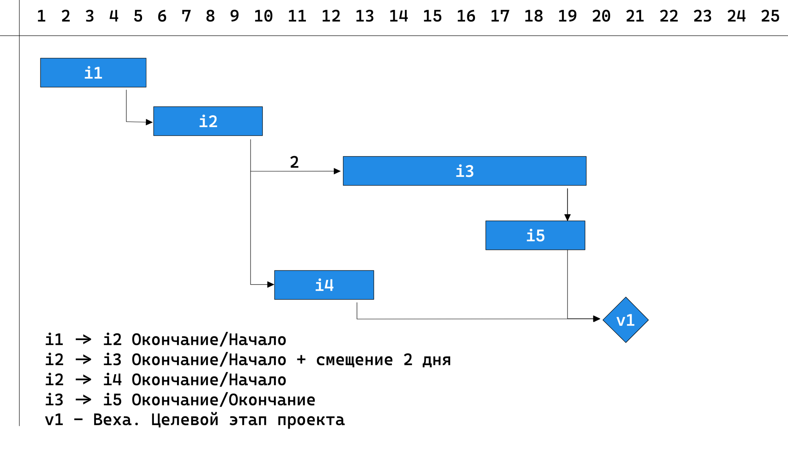
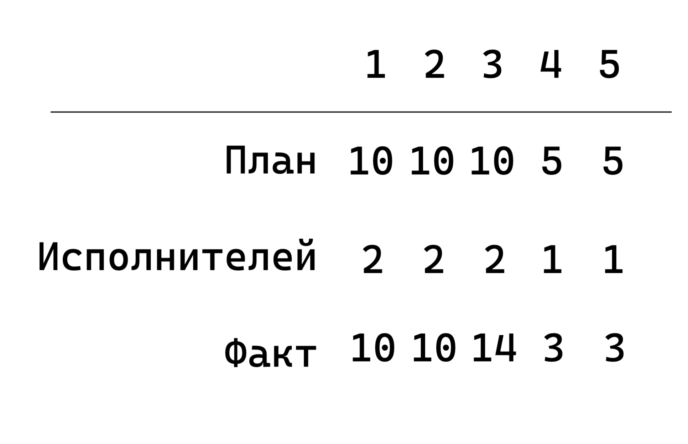
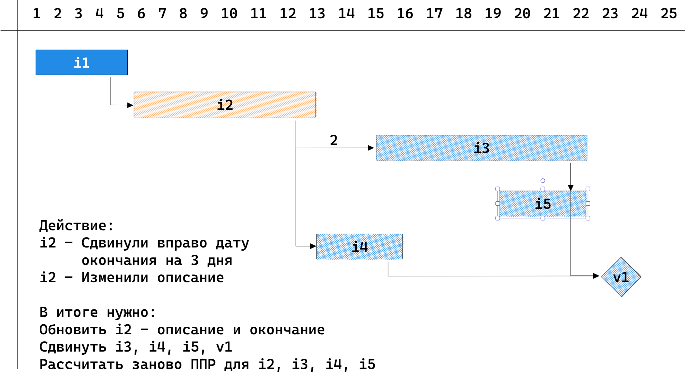
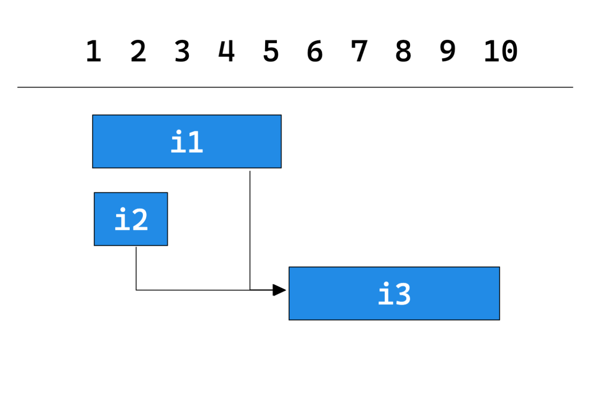

<!-- _paginate: false -->

# DDD на практическом примере:
## Расчет диаграммы Ганта

Автор: `Шапошников Евгений`
ЯП: `JavaScript`

---

# Про что поговорим:

- Что такое DDD
- Примеры кода и реализаций
- Проблемы DDD и их оптимизации

---

#  Что такое DDD?

**DDD** - domain driven design
Domain - предметная область

---

# График Ганта

## Введение в предметную область

---



---

# Работа

## хранит данные:

- Заголовок, описание...
- Время: `начала`, `конца`
- Ресурсы: `объем`, сколько выполнено
- Исполнители
- ...

---

# ППР (посуточное планирование работ)



---

#  Единый язык

| RUS                                      | ENG       |
|------------------------------------------|-----------|
| График                                   | plan      |
| Элемент графика                          | plan_item |
| Зависимость между элементами (стрелочки) | deps      |
| ППР                                      | ppr       |

---

# Сценарий:

Пользователь изменил:
- длительность элемента на графике `i2` 
- описание  работы

Результат:
- Информация о работе `i2` должна изменить
- Зависимые от `i2` работы должны сдвинуться
- ППР измененных задач должны быть пересчитаны


---




---
# Стратегическое проектирование

- Описали наш ограниченный контекст.
    В нашем случае он один. Для разделения на контексты используется `Event Storming`
- Сформировали единый язык для контекста
- Выделили сценарии


---

# Тактическое проектирование

Основные сущности:
- Агрегат
- Репозиторий
- Сервис

---

# В коде

```javascript
export const addGantItem = async (params, { repoTask, repoGant, repoPPR, transaction }) => {
    let gant, pprs;
    const item = repoPlanItem.restoreOrFail(params.plan_item_id);
    item.update(params);
    
    if (item.hasChanges('time_range', 'dependencies')) {
        gant = await repoGant.restore(params.plan_id);
        gant.addDependencies(item, params.dependencies)
            .calcPositions()

        const changedItemsIds = gant.getChangedPositionsIds();
        pprs = await repoPPR.restoreByGantItems(changedItemsIds);
        for (const ppr of pprs) {
            const change = gant.getChangeItemById(ppr.plan_item_id);
            ppr.applyPositionChange(change);
        }
    }

    await repoTask.persist(task);
    await repoGant.persist(gant);
    await repoPPR.persist(pprs);
}
```

---

# Список агрегатов

- Элемент графика (работа)
- График Ганта
- ППР

---

# Как написать агрегат. Подготовка


```javascript

class Gant extends BaseAggregate {
    ...
    constructor(items, deps) {
        this.items = items;
        this.deps = deps;
        this.index();
    }

    index() {
        this.mapItemIdToItem = toMap(this.items, 'plan_item_id'); // (1)
        this.mapItemIdToSuccIds = toMapGroup(this.items, 'pred_id'); // (2)
    }
}
```
---

# Как написать агрегат. Бизнес логика


```javascript

class Gant extends BaseAggregate {
    ...

    changePositionForItem(plan_item_id, position) {
        const item = this.mapItemIdToItem[plan_item_id];
        if (!item) throw new Error(`Гант не содержит ..."`);
        if (position.start > position.end) throw new Error(`Начало интервала ...`);

        if (item.start !== position.start || item.end !== position.end) {
            item.start = position.start;
            item.end = position.end;
            this.addChange(item.plan_item_id, 'item', 'update', ['start', 'end']}); // (1)
            this.calcPositions(); // (2)
        }
    }
}
```

---
# Как написать агрегат. Расчет смещения


```javascript

class Gant extends BaseAggregate {
    ...

    calcPositions() {
        for (const item of walkGant(this.items, this.deps)) {
            const position = this.getNewPositionForItem(item);
            this.changePositionForItem(position);
        }
    }
    ...
}
```
---
# Как написать агрегат. Регистрация изменений


```javascript

class BaseAggregate {
    ...
    changes = new Map();

    addChange(id, entity, action, params) {
        if (this.changes.has(id)) {
            this.changes.set(id, {
                entity,
                action,
                params
            })
        } else {
            // логика по объединению изменений
        }
    }

    getChanges({ batch }) {
        const changes = [];
        for (const [id, { entity, action, params }] of Object.entries(this.changes)) {
            changes.push({ entity, action, params })
        }
        return toBatch(changes, batch);
    }
}
```

---
# Как написать репозиторий

```javascript

class GantRepository {
    ...
    async restore(plan_id) {
        const items = await this.findItemsByPlanId(plan_id);
        const deps = await this.findDepsByPlanId(plan_id);
        return new Gant(items, deps);
    }

    async persist(gant) {
        return this.manager.transaction(mng => {
            for (const batch of gant.getChanges({ batch: 100 })) {
                const queries = batch.map(makeSqlFromChange);
                await mng.query(queries);
            }
        });
    }
    ...
}
```

---

# Как написать репозиторий

- Чтение выполняется напрямую из базы
- Можно срезать углы и выполнить бизнес логику через SQL

```javascript

class GantRepository {
    ...
    async findList(filter) { ... }
    async findOne(id) { ... }
    async hasInDataRange(id) { ... }
    async cloneToVersion(id, version) { ... }
    ...
}
```

---
# Пример **Unit** теста. Тест кейс



---
# Пример **Unit** теста. Реализация

```javascript
describe('GantItem.calcPosition() несколько связей', () => {
  it('Для i3 берем окончание от i1, так как она дает "худшее" время', async () => {
    // Восстанавливаем состояние
    const i1 = ensureItem({ id: 'i1', start_time: 0, end_time: 5});
    const i2 = ensureItem({ id: 'i2', start_time: 0, end_time: 2});
    const i3 = ensureItem({ id: 'i3', start_time: 0, end_time: 5});
    i1.setDeps(i3, EDependencyType.FS);
    i2.setDeps(i3, EDependencyType.FS);

    // Выполняем целевое действие 
    i3.calcPosition();

    // Проверяем результат
    expect(i3.getTimeRange()).toEqual({ start_time: 5, end_time: 10 });
  });
});
```

---

# Пример **Unit** теста. Функция `ensureItem`

```javascript
export const ensureItem = (data: Partial<EnsureItemOptions>): GantItem {
  const defaultParams = {
    id: data.id ?? guId(),
    parent_id: undefined,
    start_time: new Date(),
    end_time: new Date(),
    type: EItemType.COMMON,
  };
  const params = {
    ...defaultParams
    ...data, 
  };

  return new GantItem(params);
};
```

---

# Плюсы для тестирования


- ? Минус - нужно править много тестов вместе с кодом


---

# Плюсы в разработке
- Возможность решать более сложные задачи
- UseCase-ы читаются как текст
- Параллельная разработка. Режим трех вкладок
- Фреймворк и БД подождут
- Контроль транзакций
- EventBased архитектура
---

# Минусы и оптимизации
---

# Минус 1. Избыточное использование памяти

Большой агрегат в котором описана логика работы: 
- Элемента графика
- Гант,
- ППР
```javascript
plan = await repoPlan.restore(params.plan_id);
plan.addItem(item, params.dependencies)
    .calc()
```

`Решение:` 
1. Грузить только нужные поля
2. Разбивать большие агрегаты на маленькие исходя из `use case`-ов
3. Сохранять через итератор порциями, т. к. SQL занимает много памяти

---


# Минус 2. Нагрузка на процессор

```javascript
class Gant extends BaseAggregate {
    constructor() {
        this.index();
    }
    
    index() {
        this.mapItemIdToItem = toMap(this.items, 'plan_item_id'); // (1)
    }   
    
    getItemById(id) {
        return this.mapItemIdToItem[id]; // Сложность O(1) вместо O(<=n)
    }
}
```

`Решение:` 
1. Использовать `key`, `value` для ускорения поиска
2. Связывание компонентов по ссылкам

---


# Минус 3. Блокировка event loop-а

```javascript
class Gant extends BaseAggregate {
    async calcPositions() {
        for await (const item of walk(this.items, 100)) {
            item.calcPosition();
        }
    }
}
```

`Решение:` Обрабатывать частями и отпускать `event loop` . Или делать расчет в фоне

```javascript
async function walk() {
    ...
    if (count++ >= batchCount) {
        count = 0;
        await new Promise((res, rej) => setImmediate(res))
    }
}
```

---


# Минус 4. Трудоемкость

В чем основная задача при таком подходе:

1. **Регистрация изменений** и получение их списком

    `Решение:` реализовать в базовом классе `BaseAggregate` или библиотеке

2. **Сохранение** потока событий в базе данных

    `Решение:` вынести логику в базовый класс `BaseRepository`

---


# Минус 5. Рейсы

После загрузки агрегата его можно изменить другой процесс
```javascript
const gant = await repoGant.restore(params.plan_id);
gant.addItem(item, params.dependencies);
await gant.calc();
await repoGant.persist(gant);
```
`Решение:`
1. Мягкая блокировка по версии. Версия должна быть больше на +1 
2. Жесткая блокировка по сессии пользователя

---
# Вопросы?