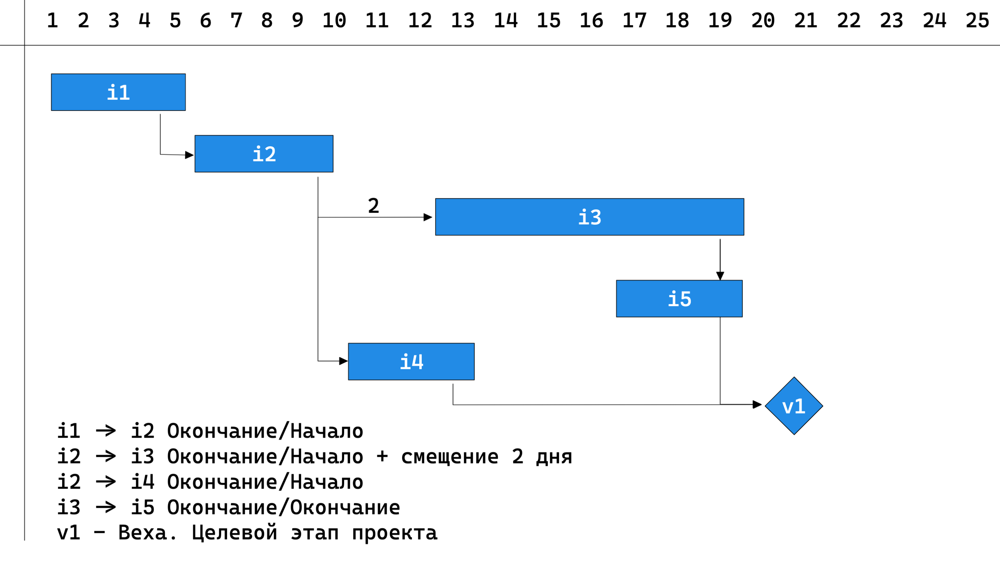
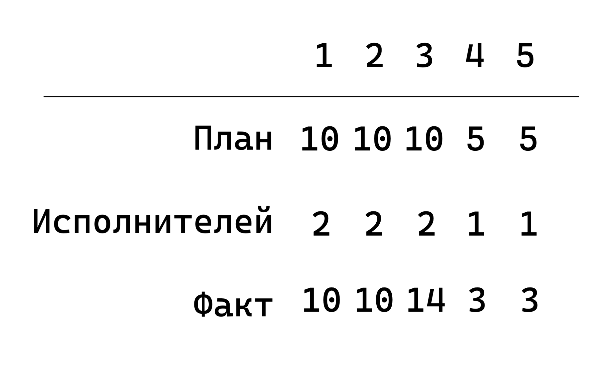
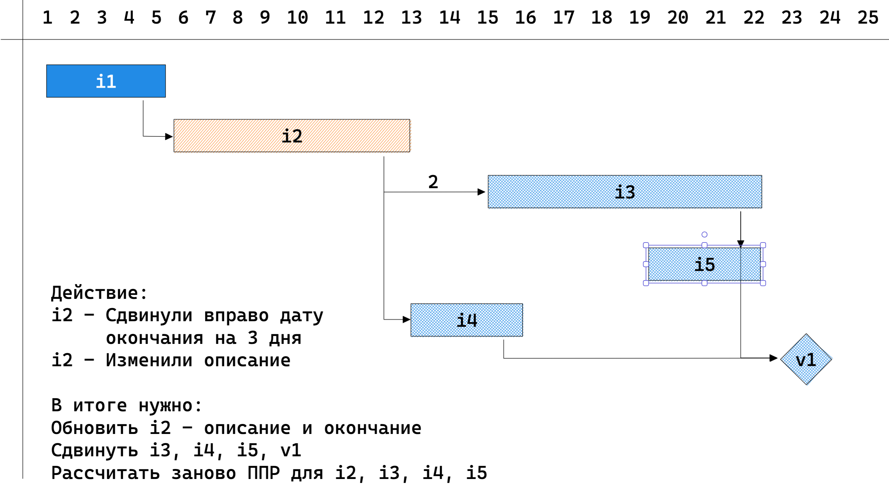
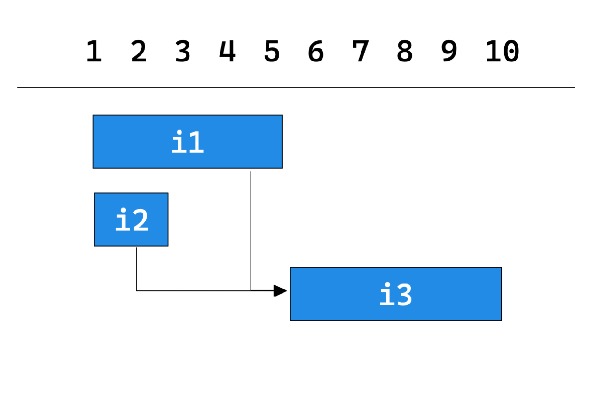
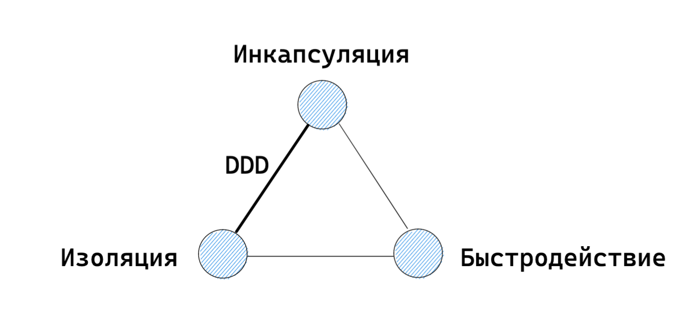

---
marp: true
paginate: true
---
<!-- _paginate: false -->

# DDD на практическом примере
## Расчет диаграммы Ганта

Автор: `Шапошников Евгений`
Компания: `lad24.ru`
Стек: `node.js`


---

# График Ганта

## Введение в предметную область (ограниченный контекст)

---



---

# Работа

## хранит данные:

- Заголовок, описание...
- Время: `начала`, `конца`
- Ресурсы: `объем`, сколько выполнено
- Список `связей` к предыдущему элементу
- Исполнители
- ...

---

# ППР (посуточное планирование работ)



---



---

# Выводы по задаче

- Много бизнес-логики
- Много сайд эффектов
- Как распределить работу?
- Как сделать надежное приложение?
- Как сделать его гибким для развития?

---

#   Для решения мы выбрали DDD

**DDD** - domain driven design
Domain - предметная область

# Тактическое проектирование (ООП)

Основные сущности:
- `Агрегат`
    - Часть модели с бизнес-логикой
- `Репозиторий`
    - Слой работы с базой данных
- `Сервис`
    - Склеивающий код, в котором взаимодействуют агрегаты
---

# Список агрегатов

- `Элемент графика` (работа)
    - Все поля, которые можно редактировать в работе
- `График Ганта` 
    - Часть информации из работы, такие как `start_time`, `end_time` и `type`
    - Список всех связей
- `ППР`
    - Распределение по дням для каждой работы

# Репозитории

- По репозиторию на агрегат

---

# Сервис для описанного сценария *

```javascript
export const changePositionGantItem = async (params, { repoPlanItem, repoGant, repoPPR }) => {
    const item = await repoPlanItem.restoreOrFail(params.plan_item_id);
    item.update(params);
    
    let gant, pprs;
    if (item.hasChanges('time_range', 'dependencies')) {
        gant = await repoGant.restore(params.plan_id);
        gant.changePositionForItem(item.plan_item_id, item.getPosition());

        const changedItemsIds = gant.getChangedPositionsIds();
        pprs = await repoPPR.restoreByGantItems(changedItemsIds);
        for (const ppr of pprs) {
            ppr.applyPositionChange(gant.getChangeItemById(ppr.plan_item_id));
        }
    }

    await repoTask.persist(task);
    await repoGant.persist(gant);
    await repoPPR.persist(pprs);
}
```

---

 # Что это нам даст?

- UseCase-ы читаются как текст
- Параллельная разработка
    - Сервис - сборочный чертеж
    - Агрегаты и репозитории - детали которые пилит команда параллельно
- Возможность решать более сложные задачи
- Фреймворк и БД подождут
- Контроль транзакций
- EventBased архитектура

---

# Пример **Unit** тестирования **

---

# Тест кейс для Unit теста



---
# Реализация **Unit** теста

```javascript
describe('GantItem.calcPosition() несколько связей', () => {
  it('Для i3 берем окончание от i1, так как она дает "худшее" время', async () => {
    // Восстанавливаем состояние
    const i1 = ensureItem({ id: 'i1', start_time: 0, end_time: 5});
    const i2 = ensureItem({ id: 'i2', start_time: 0, end_time: 2});
    const i3 = ensureItem({ id: 'i3', start_time: 0, end_time: 5});
    i1.setDeps(i3, EDependencyType.FS);
    i2.setDeps(i3, EDependencyType.FS);

    // Выполняем целевое действие 
    i3.calcPosition();

    // Проверяем результат
    const change = i3.getChange();
    expect(change.action).toEqual('update');
    expect(change.params).toEqual({ start_time: 5, end_time: 10 });
  });
});
```

---

# Функция `ensureItem`

```javascript
export const ensureItem = (data: Partial<EnsureItemOptions>): GantItem {
  const defaultParams = {
    id: data.id ?? guId(),
    parent_id: undefined,
    start_time: new Date(),
    end_time: new Date(),
    type: EItemType.COMMON,
  };
  const params = {
    ...defaultParams
    ...data, 
  };

  return new GantItem(params);
};
```

---

# Плюсы для тестирования


---

---

# Стратегическое проектирование (управление проектом)

- Разделение на ограниченные контексты
- Формирование единого языка для контекста
- Выделение сценариев

`Event Storming` - инструмент для совместного достижения этих пунктов


---

#  Единый язык

| RUS                                      | ENG             |
|------------------------------------------|-----------------|
| График                                   | plan            |
| Элемент графика (работа)                 | plan_item       |
| Зависимость между элементами (стрелочки) | deps            |
| ППР                                      | ppr             |
| Начало выполнения работы                 | start_time      |
| Окончание выполнения работы              | end_time        |

---

# Сценарий:

Пользователь изменил:
- Длительность элемента на графике `i2` 
- Описание  работы

Результат:
- Информация о работе `i2` должна измениться
- Зависимые от `i2` работы должны сдвинуться
- ППР измененных задач должны быть пересчитаны

---

# Вот теперь это DDD, до этого было ООП

Сценарий из UseCase-а был переведен в код сервиса без искажений

---

# Реализация

---

# Как написать репозиторий?

```javascript
    const item = await repoPlanItem.restoreOrFail(params.plan_item_id);
    // ...
    const gant = await repoGant.restore(params.plan_id);
    // ...
    const pprs = await repoPPR.restoreByGantItems(changedItemsIds);
    // ...
    await repoTask.persist(task);
    await repoGant.persist(gant);
    await repoPPR.persist(pprs);
```
---

# Пример репозитория

```javascript

class GantRepository {
    ...
    async restore(plan_id) {
        const items = await this.findItemsByPlanId(plan_id);
        const deps = await this.findDepsByPlanId(plan_id);
        return new Gant(items, deps); // Инкапсуляция, изоляция (бомба)
    }

    async persist(gant) {
        return this.manager.transaction(mng => {
            for (const batch of gant.getChanges({ batch: 100 })) {
                const queries = batch.map(makeSqlFromChange);
                await mng.query(queries);
            }
        });
    }
    ...
}
```

---

# Оптимизация репозитория

- Чтение выполняется напрямую из базы
- Можно срезать углы и выполнить бизнес-логику через `SQL`

```javascript

class GantRepository {
    ...
    // !!! Чтение без использования DDD !!!
    async findList(filter) { ... } 
    async findOne(id) { ... }

    // Валидаторы см. DDD трилемма
    async hasInDataRange(id) { ... }
    async cloneToVersion(id, version) { ... }
    ...
}
```

---
# Как написать агрегат?

--- 

# Инициализация и оптимизация в агрегате


```javascript

class Gant extends BaseAggregate {
    ...
    constructor(items, deps) {
        this.items = items;
        this.deps = deps;
        this.index();
    }

    private index() {
        this.mapItemIdToItem = toMap(this.items, 'plan_item_id'); // (1)
        this.mapItemIdToSuccIds = toMapGroup(this.items, 'pred_id'); // (2)
    }
}
```
---
# Бизнес-логика в агрегате


```javascript

class Gant extends BaseAggregate {
    ...

    changePositionForItem(plan_item_id, position) {
        if (this.setPositionForItem(plan_item_id, position)) {
            this.calcPositions();
        }
    }

    private setPositionForItem(plan_item_id, position) {
        const item = this.mapItemIdToItem[plan_item_id];
        if (!item) throw new Error(`Гант не содержит элемент с указанным ID`);
        if (position.start > position.end) throw new Error(`Начало интервала не может быть ...`);

        if (item.start !== position.start || item.end !== position.end) {
            item.start = position.start;
            item.end = position.end;
            this.addChange('item', item.plan_item_id, 'update', ['start', 'end']});
            return true;
        } else {
            return false;
        }
    }
}
```

---

# Расчет смещения в агрегате


```javascript

class Gant extends BaseAggregate {
    ...

    private calcPositions() {
        for (const item of walkGant(this.items, this.deps)) {
            const position = this.getNewPositionForItem(item);
            this.setPositionForItem(item.plan_item_id, position);
        }
    }
    ...
}
```
---
# Регистрация изменений в агрегате


```javascript

class BaseAggregate {
    ...
    changes = new Map();

    addChange(source, id, action, columns) {
        if (!this.changes.has(id)) {
            this.changes.set(id, {
                source,
                action,
                columns
            })
        } else {
            // логика по объединению изменений
        }
    }
}
```

---
# Получение изменений агрегата


```javascript

class BaseAggregate {
    ...
    changes = new Map();

    getChanges(batch = 100) {
        const changes = [];
        for (const [id, { source, action }] of Object.entries(this.changes)) {
            const params = this.getChangedParams(id);
            changes.push({ source, action, params })
        }
        return toBatch(changes, batch);
    }
}
```

---

# Минусы и оптимизации
---

# DDD трилемма


> Взято из доклада Владимира Хорикова "Domain-driven design: Самое важное"
- CAP теорема - аналог, только для баз данных

---

# Минус 1. Избыточное использование памяти

Большой агрегат в котором описана логика работы: 
- Элемента графика
- Гант
- ППР
```javascript
plan = await repoPlan.restore(params.plan_id);
plan.changePositionForItem(item, params.dependencies);
```

`Решение:` 
1. Грузить только нужные поля
2. Разбивать большие агрегаты на маленькие исходя из `use case`-ов
3. Сохранять через итератор порциями, так как SQL занимает много памяти
4. Выбирать другие грани из DDD трилеммы

---


# Минус 2. Нагрузка на процессор

```javascript
class Gant extends BaseAggregate {
    constructor() {
        this.index();
    }
    
    index() {
        this.mapItemIdToItem = toMap(this.items, 'plan_item_id'); // (1)
    }   
    
    getItemById(id) {
        return this.mapItemIdToItem[id]; // Сложность O(1) вместо O(<=n)
    }
}
```

`Решение:` 
1. Использовать `key`, `value` для ускорения поиска
2. Связывание компонентов по ссылкам

---


# Минус 3. Блокировка event loop-а

```javascript
class Gant extends BaseAggregate {
    private async calcPositions() {
        for await (const item of walkGant(this.items, this.deps, 100)) {
            const position = this.getNewPositionForItem(item);
            this.setPositionForItem(item.plan_item_id, position);
        }
    }
}
```

`Решение:` Обрабатывать частями и отпускать `event loop` или в фоне

```javascript
async function walkGant(items, deps, batchCount) {
    ...
    if (count++ >= batchCount) {
        count = 0;
        await new Promise((res, rej) => setImmediate(res)) // 0 задержка
    }
}
```

---


# Минус 4. Трудоемкость

В чем основная задача при таком подходе:

1. **Регистрация изменений** и получение их списком

    `Решение:` реализовать в базовом классе `BaseAggregate` или библиотека

2. **Сохранение** потока событий в базе данных

    `Решение:` вынести логику в базовый класс `BaseRepository`

---


# Минус 5. Рейсы

После загрузки агрегата его может изменить другой процесс
```javascript
const gant = await repoGant.restore(params.plan_id);
await gant.changePositionForItem(item.plan_item_id, item.getPosition());
await repoGant.persist(gant);
```
`Решение:`
1. Мягкая блокировка по версии. Версия должна быть больше на +1 
2. Жесткая блокировка по сессии пользователя

---
# Вопросы?

